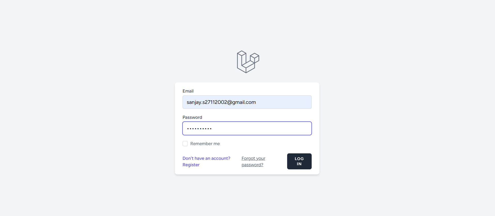
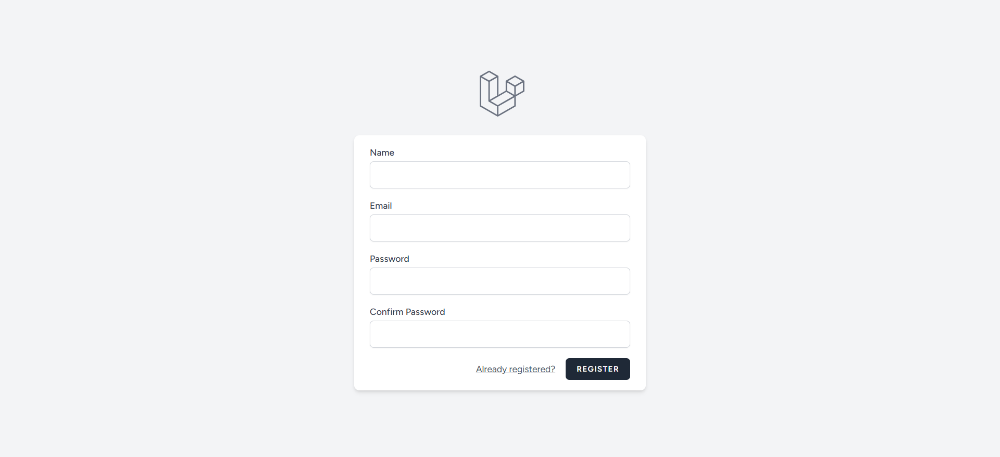
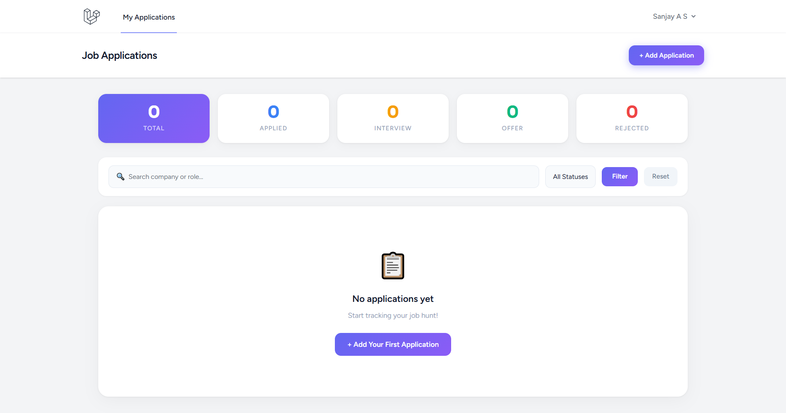
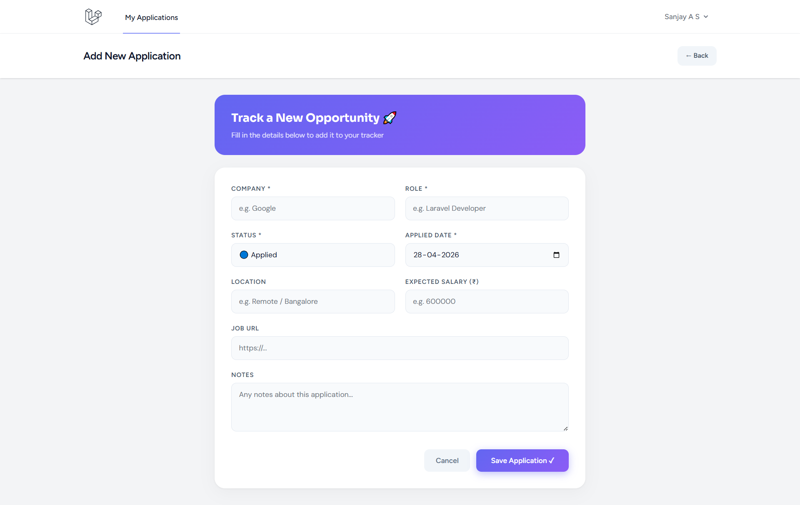
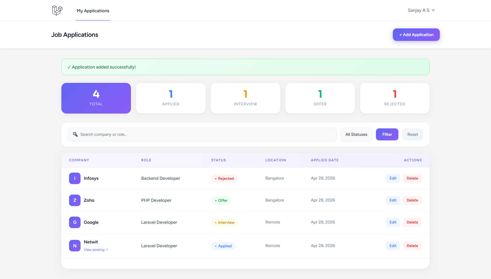
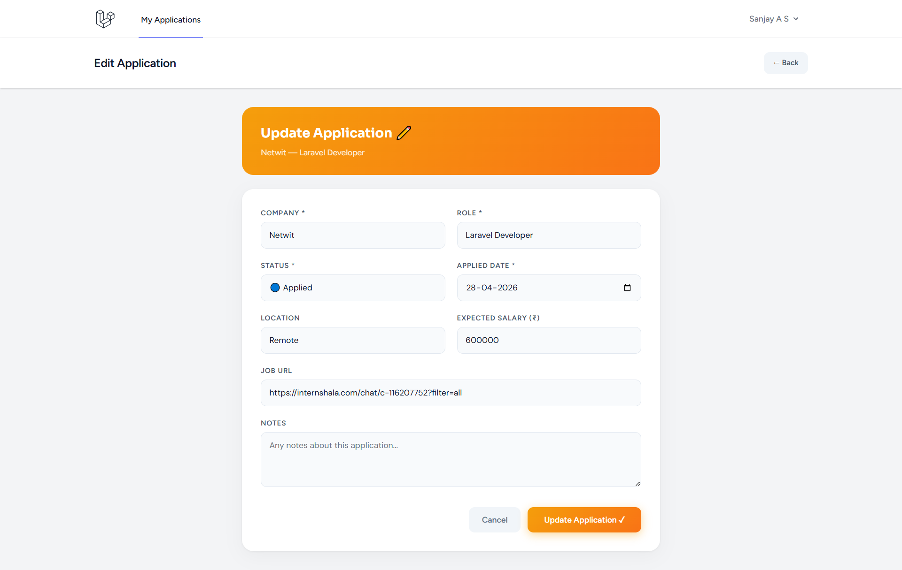
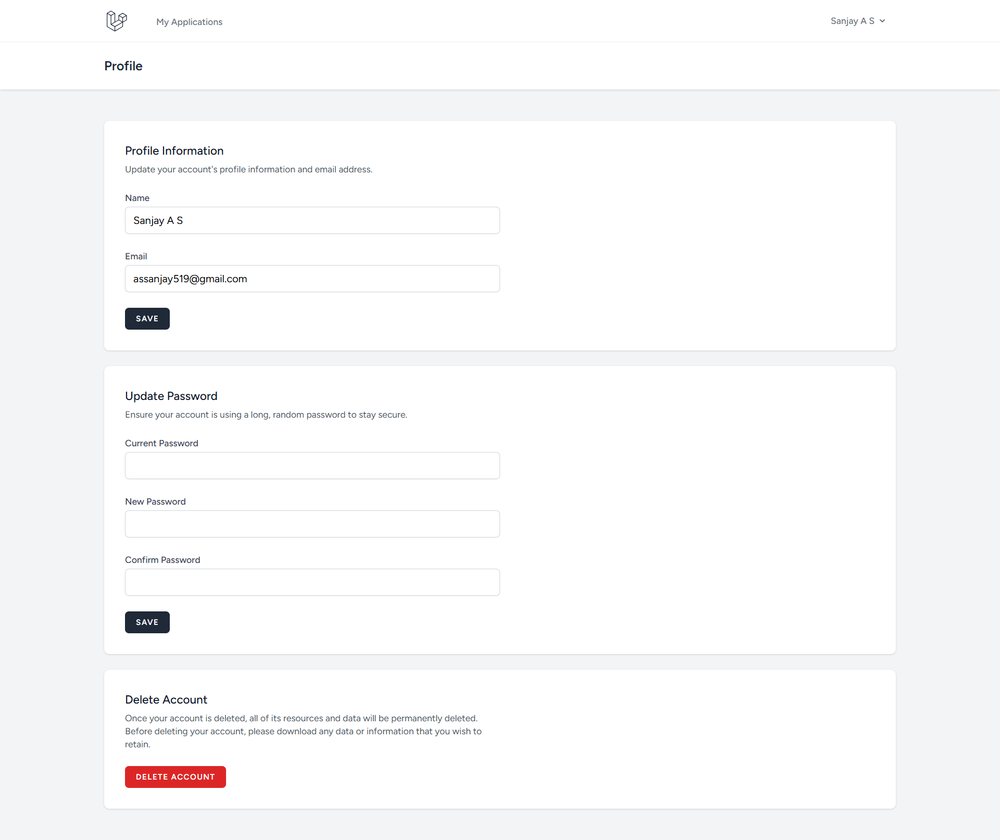

# JobTracker — Laravel Job Application Tracker

A full-stack web application built with **Laravel 13** to track job applications through their entire lifecycle — from applied to offer or rejection.

## 🔗 Links
- **GitHub:** https://github.com/Sanjayas27/jobtracker
- **Portfolio:** https://sanjay-portfolio-woad.vercel.app/
- **Built by:** Sanjay A S

---

## 📸 Screenshots

### Login Page


### Register Page


### Dashboard (Empty State)


### Add Application


### Dashboard with Data


### Edit Application


### Profile Page


---

## ✨ Features

- 🔐 **Authentication** — Register, login, logout via Laravel Breeze
- 📋 **Full CRUD** — Add, edit, delete job applications
- 📊 **Stats Dashboard** — Live counts for Total, Applied, Interview, Offer, Rejected
- 🔍 **Search & Filter** — Filter by status, search by company or role
- 👤 **Per-user data** — Each user sees only their own applications
- 🎨 **Beautiful UI** — Gradient cards, color-coded status badges, company avatars

---

## 🛠️ Tech Stack

| Layer | Technology |
|-------|-----------|
| Framework | Laravel 13 (PHP 8.3) |
| Auth | Laravel Breeze |
| Frontend | Blade Templates, Tailwind CSS |
| Database | SQLite |
| ORM | Eloquent |
| Routing | Laravel Resource Routes |

---

## 🚀 Local Setup

```bash
# Clone the repo
git clone https://github.com/Sanjayas27/jobtracker.git
cd jobtracker

# Install dependencies
composer install
npm install

# Setup environment
cp .env.example .env
php artisan key:generate

# Run migrations
php artisan migrate

# Start server
php artisan serve
```

Visit `http://127.0.0.1:8000`

---

## 📁 Project Structure

app/
├── Http/Controllers/
│   └── JobApplicationController.php   # Full CRUD controller
├── Models/
│   └── JobApplication.php             # Eloquent model
database/
├── migrations/
│   └── create_job_applications_table  # Schema definition
resources/views/
├── jobs/
│   ├── index.blade.php                # Dashboard
│   ├── create.blade.php               # Add form
│   └── edit.blade.php                 # Edit form
routes/
└── web.php                            # All routes

---

Built with ❤️ by [Sanjay A S](https://sanjay-portfolio-woad.vercel.app/)